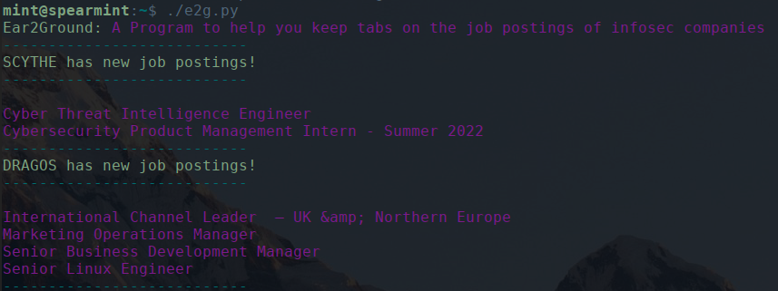

# Ear 2 Ground
Ear2Ground is a python learning project that I created to show you new job postings from security websites (or really any site). The idea behind this is not to scrape every *site*, but to provide a framework you can modify for the company's *you're* interested in. This tool comes pre-configured to look at [Dragos](https://www.dragos.com/) and [Scythe](https://www.scythe.io) but the real power is adding your own sites! Unfortunetly this is hard to without looking at the code for each site but I've written e2g to be fairly modular and only require a few code changes to add your own. 


# Installation
> Make sure you're running python version 3.10!

Installing python3.10
```bash
sudo apt install software-properties-common -y
sudo add-apt-repository ppa:deadsnakes/ppa
sudo apt update -y
sudo apt upgrade -y
sudo apt install python3.10
sudo apt install python3-pip
python3.10 --version # Make sure python3 is installed


```

## Installing ear2ground
```bash
git clone https://github.com/grahamhelton/Ear2Ground
pip install -r requirements.txt
python3.10 e2g.py
```

# Usage
## 
Simply run `python3.10 e2g.py`

Job postings are stored in `./data/{company_name}`

The first time you run the program it will return all the job postings. After it has built the initial list of postings it will only return new job postings.
